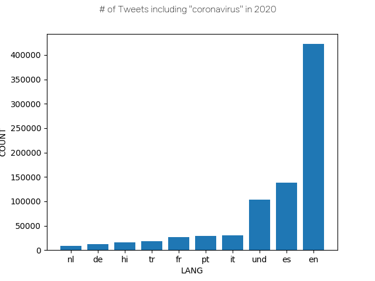
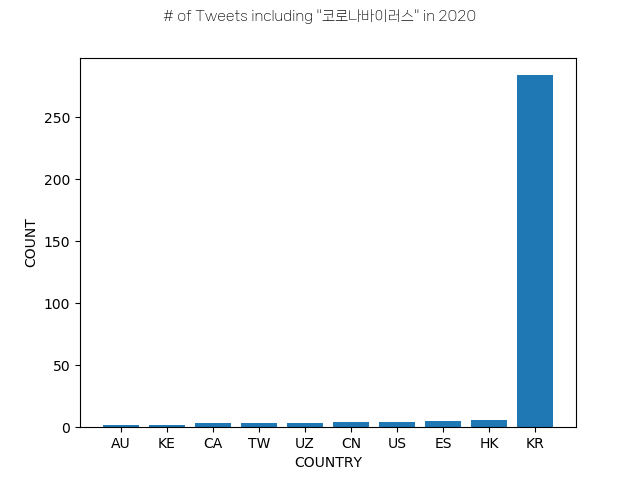
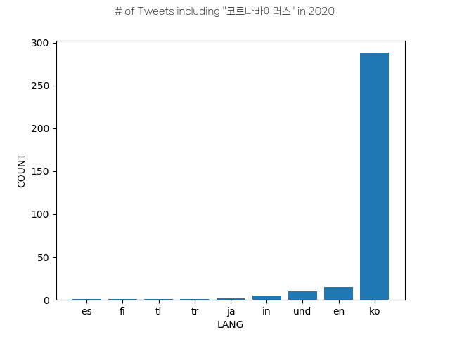

# Coronavirus Twitter Analysis

In this project, we scan all geotagged tweets sent in 2020 to monitor for the spread of coronavirus on social media. We filter our data by two queries (`#coronavirus` and `코로나바이러스`) and aggregate the top 10 _countries_ and _languages_ we see the tweets in.

# Procedure

The Twitter dataset used in this project stores tweets for each day in the format `geoTwitterYY-MM-DD.zip` with tweet data stored in JSON format. We use a **MapReduce** algorithm to analyze these tweets as seen in the following image:

The `run_maps.sh` shell script runs the `map.py` function over each file in the dataset. This creates an `outputs` folder containing data for each day in 2020 segmented by _country_ and _language_. We then use the `reduce.py` function to combine all the `.lang` files into a single file, and all of the `.country` files into a different file to prepare for visualization. Lastly, the `visualize.py` file generates a bar graph of the results.

_Note: We use the `nohup` command when running the shell script as each call to `map.py` takes a significant amount of time to finish_

# Results

#### Tweets including 'coronavirus' in 2020 by Country

Here are the top 10 countries who published tweets including `#coronavirus`. A significant volume of tweets can be seen coming from the United States, India and Great Britain.

#### Tweets including 'coronavirus' in 2020 by Language

Here are the top 10 languages who published tweets including `#coronavirus`. We can see the bulk of tweets being written in English and Spanish.

#### Tweets including '코로나바이러스' in 2020 by Country

Here are the top 10 countries who published tweets including `#코로나바이러스`. As expected, the majority of these tweets came from Korea. 

#### Tweets including '코로나바이러스' in 2020 by Language

Here are the top 10 languages who published tweets including `#코로나바이러스`. Once again, most of the tweets were written in Korean with a few being written in English.
